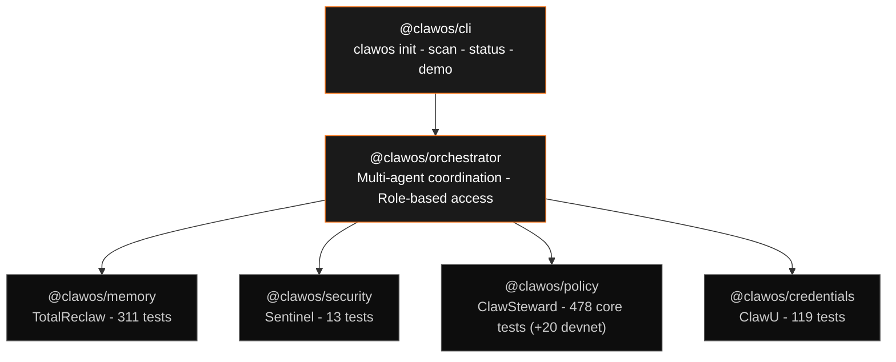
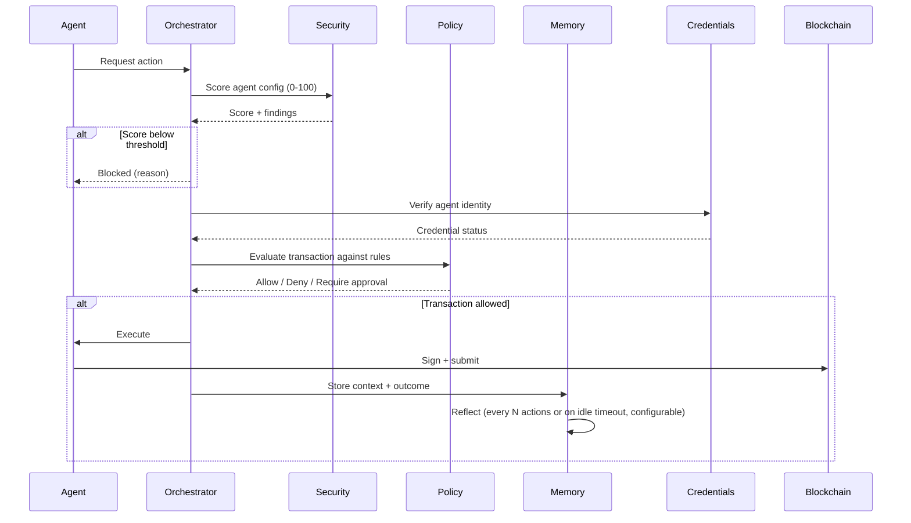

# ClawOS Architecture

ClawOS is the kernel for company-grade AI agents: persistent reflective memory, zero-trust security scanning, declarative policy enforcement, and on-chain verifiable credentials as first-class primitives — the missing OS layer between raw LLM calls and production multi-agent systems.

**Status (May 1, 2026):** Core 4 packages shipped. 928/928 tests passing, 0 failures. `pnpm test` exits 0 on clean checkout.

## Layer Cake



> **Hard Rule.** Core services — memory, security, policy, credentials — never import each other. The orchestrator is the only package that touches multiple core services. The CLI talks to the orchestrator and nothing else. This isn't convention. It's enforced by the dependency graph in each `package.json`. No core package lists another core package as a dependency.

## Data Flow



### What each step does

**Security scan.** Sentinel scores the agent's configuration 0–100 before any action executes. Checks API key exposure, permission scope, transport security, model access controls. Zero dependencies — runs anywhere Node runs. This is the gate that caught a leaked Helius mainnet API key in production.

**Credential verification.** ClawU confirms the agent holds a valid credential. Credentials are cryptographically signed (Ed25519) with optional on-chain anchoring to Base (Solidity 0.8.26, OpenZeppelin upgradeable). Registry, Classroom, and Treasury contracts deployed on Base Sepolia — mainnet deployment gated behind proven demand.

**Policy evaluation.** ClawSteward enforces pre-signing rules on every transaction. Spending limits, counterparty allowlists, time-of-day restrictions, multi-sig thresholds. Policies are declarative JSON — no code changes required to update rules. 478 tests (+ 20 devnet tests that self-skip without `SOLANA_RPC_URL`).

**Memory persistence.** TotalReclaw stores the full context of what happened and why. Retrieval, reflection, capture, and injection subsystems. Reflection triggers periodically to compress and synthesize — agents don't just remember, they learn which memories matter. 311 tests. Python, SQLite-backed, zero external services required.

## Package Boundaries

| Package | Language | Test Runner | Tests | External Deps |
|---------|----------|-------------|-------|---------------|
| memory | Python 3.10+ | pytest | 311 | None (SQLite stdlib) |
| security | TypeScript | node:test | 13 | None (zero-dep) |
| policy | TypeScript | vitest | 478 (+20 devnet) | better-sqlite3 |
| credentials | Solidity 0.8.26 | Foundry (forge) | 119 | OpenZeppelin 5.x |
| orchestrator | TypeScript | vitest | 7 | in-process calls + stdio shim to Python |
| cli | TypeScript | — | scaffold | commander, chalk |

## Where State Lives

- **Memory:** SQLite database per agent, managed by TotalReclaw. No external database required.
- **Credentials:** On-chain (Base Sepolia) or local signing. Registry contract holds the canonical credential map.
- **Policy:** Declarative JSON files in `packages/policy/policies/` (hot-reloadable). SQLite for audit logs only.
- **Security:** Stateless. Every scan is a pure function of the config passed in.

## Coordination Model & Runtime

**How packages talk.** Orchestrator uses direct async calls (in-process, single Node event loop) for TypeScript packages. Python memory is invoked via stdio JSON shim (`packages/memory` provides `cli.py`). No event bus or message queue — parallel agent swarms and in-memory EventEmitter planned for v0.3.

**Agent onboarding (`clawos init`).** Generates Ed25519 keypair + local SQLite DB, registers optional on-chain credential via ClawU, scaffolds default policy JSON + Sentinel config, registers the agent with orchestrator. One command, 30 seconds to first signed transaction.

**Config & secrets.** Policies = hot-reloadable JSON. Agent configs + memory in per-agent SQLite. Secrets via env/OS keychain only — Sentinel hard-fails on any hardcoded key or overly broad scope. No central config service.

**Deployment.** CLI is local/dev. Production agents run as long-lived Node processes (PM2, systemd, or Docker). Memory DBs are single files — rsync/backup trivial. Dashboard is Next.js placeholder (v0.2: multi-tenant UI + metrics). No k8s manifest yet.

**Error propagation.** Sentinel = hard block (score threshold). Policy denial returns structured `{allow: false, reason, remediation}`. Memory reflection failures are non-fatal — logged, agent continues with last good context. No circuit breakers or retries in v0.1; failure modes are explicit in the sequence diagram alt paths.

## Monorepo Structure

```
clawos/
├── apps/dashboard/          # Next.js dashboard (placeholder, not in test count)
├── packages/
│   ├── cli/                 # Entry point — delegates to orchestrator
│   ├── credentials/         # Foundry project (src/ test/ script/ lib/)
│   ├── memory/              # Python package (editable install, .venv)
│   ├── orchestrator/        # Coordination layer (scaffold)
│   ├── policy/              # TS + vitest + MCP server
│   └── security/            # TS, zero-dep scanner
├── docs/
├── ARCHITECTURE.md          # ← You are here
├── VISION.md
└── README.md
```

Managed by pnpm workspaces. `pnpm test` from root runs all four active test suites sequentially — 928 tests pass, 0 failures.
