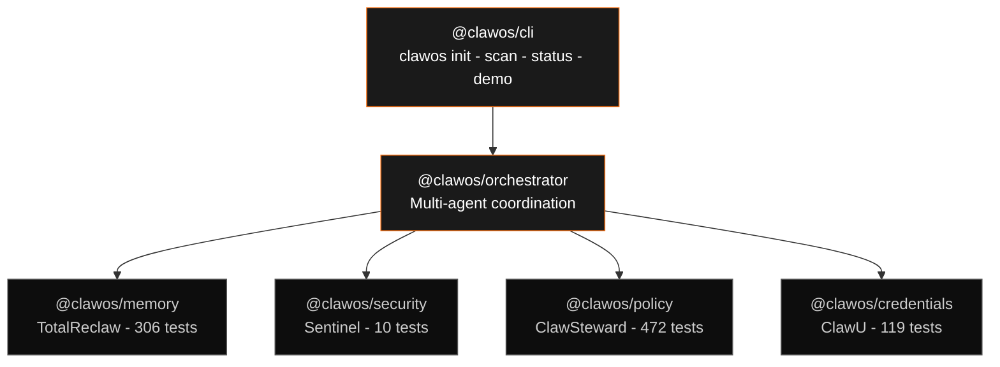

<p align="center">
  <strong>ClawOS</strong><br/>
  The AI operating system for companies.
</p>

<p align="center">
  
  
  
  
</p>

---

AI agents today are stateless, unsecured, and uncoordinated. They forget everything between calls, run with god-mode API keys, sign transactions without guardrails, and can't prove who they are. Companies can't put them in front of real money, customers, or compliance teams.

ClawOS fixes this. It's the missing control plane — persistent memory, policy-enforced security, verifiable credentials, and multi-agent orchestration as a unified kernel. Agents that remember, follow rules, prove identity, and work together.

Unlike LangChain (stateless chains), CrewAI (orchestration only), or Dust (knowledge layer without identity or guardrails), ClawOS is the full kernel — memory, security, policy, and credentials as first-class primitives.

> Built for engineering teams shipping production multi-agent systems in finance, operations, or regulated workflows — where stateless scripts fail audit and can't touch real money.

## Quick Start

```bash
git clone https://github.com/SkunkWorks0x/clawos.git
cd clawos && pnpm install
pnpm test  # 928 tests, 0 failures
```

## Test Summary

| Package | Tests | Passing | Runner |
|---------|-------|---------|--------|
| memory | 311 | 311 | pytest |
| security | 13 | 13 | node:test |
| policy | 478 (+20 devnet) | 478 | vitest |
| credentials | 119 | 119 | Foundry |
| orchestrator | 7 | 7 | vitest |
| **Total** | **928** | **928** | — |

`pnpm test` from root. All suites. Zero failures.

## Demo

```bash
pnpm demo  # clawos init → Sentinel scan → policy-approved tx → memory reflection
```


*End-to-end: `clawos init` → Sentinel scan (score 94) → policy-approved transaction → memory reflection + on-chain credential anchor.*

## Architecture



> Core packages never import each other. The orchestrator is the only cross-cutting layer. [Full architecture →](./ARCHITECTURE.md)

## Packages

### [@clawos/memory](./packages/memory/) — TotalReclaw

Persistent memory + reflection engine. Agents compound context over time — retrieval, capture, injection, and periodic reflection that compresses experience into reusable knowledge. SQLite-backed, zero external services.

`311 tests` · Python 3.10+ · pytest

### [@clawos/security](./packages/security/) — Sentinel

Zero-dependency security scanner. Scores agent configurations 0–100 across API key exposure, permission scope, transport security, and model access controls. This is the gate that caught a leaked Helius mainnet API key in production.

`13 tests` · TypeScript · node:test · zero deps

### [@clawos/policy](./packages/policy/) — ClawSteward

Pre-signing policy enforcement for agent transactions. Spending limits, counterparty allowlists, time-of-day restrictions, multi-sig thresholds. Policies are declarative JSON — update rules without code changes.

`478 tests` (+20 devnet) · TypeScript · vitest

### [@clawos/credentials](./packages/credentials/) — ClawU

Verifiable credential management for AI agents. Ed25519 cryptographic signing with optional on-chain anchoring to Base (Solidity 0.8.26, OpenZeppelin 5.x). Registry, Classroom, and Treasury contracts deployed on Base Sepolia.

`119 tests` · Solidity · Foundry

### [@clawos/orchestrator](./packages/orchestrator/)

Multi-agent swarm coordination with role-based access control. Direct async calls to TypeScript packages, stdio JSON shim to Python memory. Shared control plane across all core services.

`7 tests` · TypeScript · vitest

### [@clawos/cli](./packages/cli/)

CLI entry point. `clawos init` generates an Ed25519 keypair, scaffolds default policies, runs a Sentinel scan, and registers the agent — 30 seconds to first signed transaction.

`scaffold` · TypeScript · commander + chalk

## Why ClawOS?

**Agents forget.** Every API call starts from zero. TotalReclaw gives agents persistent, reflective memory — they don't just store context, they learn which memories matter.

**Agents are insecure.** Most agent configs ship with overly broad API keys and no audit trail. Sentinel scores every config before execution and hard-blocks anything below threshold.

**Agents can't prove identity.** There's no standard way for an agent to cryptographically prove who it is or who authorized it. ClawU issues verifiable credentials with optional on-chain anchoring.

**Agents have no guardrails.** Agents sign transactions without policy checks. ClawSteward enforces spending limits, allowlists, and approval flows — declaratively, before the signature happens.

**Agents can't coordinate.** Multi-agent systems are duct-taped together with ad-hoc message passing. The orchestrator provides a shared control plane with role-based access across all four core services.

## Project Structure

```
clawos/
├── packages/
│   ├── cli/                 # clawos init · scan · status · demo
│   ├── credentials/         # Foundry — ClawU contracts + tests
│   ├── memory/              # Python — TotalReclaw engine
│   ├── orchestrator/        # Multi-agent coordination
│   ├── policy/              # ClawSteward policy enforcement
│   └── security/            # Sentinel zero-dep scanner
├── apps/dashboard/          # Next.js dashboard (placeholder)
├── docs/
├── ARCHITECTURE.md          # Layer cake, data flow, runtime model
├── VISION.md                # What, why, where it's going
└── README.md                # ← You are here
```

## Docs

- **[ARCHITECTURE.md](./ARCHITECTURE.md)** — Layer cake diagram, data flow, package boundaries, coordination model, deployment, error propagation.
- **[VISION.md](./VISION.md)** — What ClawOS is, why it needs to exist, where it's going.

---

`pnpm test` · All 928 tests pass on clean checkout · PRs welcome — see [ARCHITECTURE.md](./ARCHITECTURE.md) for the hard package boundary rule.

## License

MIT
